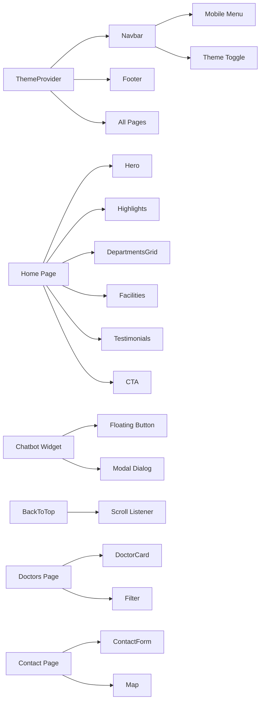

# Prince Hospital Website - Implementation Checklist

## ✅ Completed Planning Phase
- [x] Requirements analysis
- [x] Technical stack selection
- [x] Project structure design
- [x] Component architecture
- [x] Design specifications
- [x] Performance strategy

## 🔄 Ready for Implementation

### Phase 1: Project Initialization
- [ ] Create Next.js 14 project with TypeScript & Tailwind
- [ ] Install core dependencies:
  - framer-motion (animations)
  - lucide-react (icons)
  - next-themes (dark mode)
- [ ] Configure shadcn/ui with components:
  - Button, Card, Dialog
  - Dropdown, Sheet, Avatar
  - Badge, Input, Textarea

### Phase 2: Layout & Core Components
- [ ] Create ThemeProvider with next-themes
- [ ] Implement Navbar component:
  - Sticky positioning
  - Logo + navigation menu
  - "Book Appointment" CTA
  - Mobile hamburger menu
  - Theme toggle
- [ ] Implement Footer component:
  - Contact details section
  - Quick links
  - Social media
  - Copyright
- [ ] Create main layout with providers

### Phase 3: Home Page Sections
- [ ] Hero section with headline and CTAs
- [ ] Quick highlights (700+ beds, diagnostics, 24/7 emergency)
- [ ] Department preview grid (6 departments)
- [ ] Facilities section with icons
- [ ] Testimonials carousel (dummy data)
- [ ] Final CTA with phone number

### Phase 4: Additional Pages
- [ ] About page (history, mission, values)
- [ ] Departments page (full department list)
- [ ] Doctors page (doctor cards grid)
- [ ] Appointment page (chatbot redirect)
- [ ] Contact page (form + details + map)

### Phase 5: Special Features
- [ ] Chatbot widget (floating button + modal)
- [ ] Back-to-top button (scroll-triggered)
- [ ] SEO metadata for all pages
- [ ] Dark mode implementation
- [ ] Smooth scroll animations

### Phase 6: Polish & Optimization
- [ ] Responsive design testing
- [ ] Performance optimization
- [ ] Accessibility improvements
- [ ] Cross-browser testing
- [ ] Lighthouse audit
- [ ] Final deployment

## Component Dependency Map



## Data Constants Needed

### Departments List
```typescript
const DEPARTMENTS = [
  { id: 1, name: "Cardiology", icon: "Heart", description: "Heart care" },
  { id: 2, name: "Neurology", icon: "Brain", description: "Brain & nerves" },
  { id: 3, name: "Orthopedics", icon: "Bone", description: "Bones & joints" },
  { id: 4, name: "Pediatrics", icon: "Baby", description: "Child care" },
  { id: 5, name: "Oncology", icon: "Microscope", description: "Cancer care" },
  { id: 6, name: "Emergency", icon: "Ambulance", description: "24/7 emergency" },
]
```

### Doctor Profiles
```typescript
const DOCTORS = [
  { id: 1, name: "Dr. Rajesh Kumar", specialization: "Cardiology", experience: "15 years" },
  { id: 2, name: "Dr. Priya Sharma", specialization: "Neurology", experience: "12 years" },
  { id: 3, name: "Dr. Amit Patel", specialization: "Orthopedics", experience: "18 years" },
  { id: 4, name: "Dr. Sunita Reddy", specialization: "Pediatrics", experience: "10 years" },
]
```

### Testimonials
```typescript
const TESTIMONIALS = [
  { id: 1, name: "Ramesh Gupta", text: "Excellent care during my heart surgery." },
  { id: 2, name: "Sita Devi", text: "The pediatric department saved my child." },
  { id: 3, name: "Vikram Singh", text: "24/7 emergency service is a lifesaver." },
]
```

## Performance Targets
- **Lighthouse Score**: > 95
- **First Contentful Paint**: < 1.8s
- **Time to Interactive**: < 3.5s
- **Cumulative Layout Shift**: < 0.1
- **Total Bundle Size**: < 500KB

## Browser Support
- Chrome 90+
- Firefox 88+
- Safari 14+
- Edge 90+

## Responsive Breakpoints
- Mobile: < 768px
- Tablet: 768px - 1024px
- Desktop: 1024px - 1440px
- Large Desktop: > 1440px

## Color Scheme Implementation

### Light Mode
- Primary: #2563eb (Hospital Blue)
- Secondary: #0d9488 (Teal)
- Background: #ffffff
- Text: #1f2937

### Dark Mode
- Primary: #3b82f6 (Lighter Blue)
- Secondary: #14b8a6 (Lighter Teal)
- Background: #0f172a
- Text: #f1f5f9

## Animation Specifications
- **Duration**: 300ms for most transitions
- **Easing**: cubic-bezier(0.4, 0, 0.2, 1)
- **Stagger delay**: 100ms between children
- **Scroll threshold**: 0.1 for whileInView

## SEO Implementation
- Meta titles and descriptions for each page
- Open Graph tags for social sharing
- Twitter Card metadata
- JSON-LD structured data (Hospital, MedicalBusiness)
- Sitemap.xml generation
- robots.txt configuration

## Deployment Checklist
- [ ] Build passes without errors
- [ ] Environment variables configured
- [ ] Domain configured (if applicable)
- [ ] SSL certificate enabled
- [ ] Analytics tracking code added
- [ ] 404 page customized
- [ ] Redirects configured (if needed)

## Maintenance Tasks
- Weekly: Check for dependency updates
- Monthly: Review analytics and performance
- Quarterly: Content updates and refresh
- Annually: Full security audit

## Risk Mitigation
1. **Performance issues**: Implement lazy loading and code splitting
2. **Browser compatibility**: Use feature detection and polyfills
3. **Mobile responsiveness**: Test on real devices
4. **Accessibility**: Use semantic HTML and ARIA labels
5. **SEO**: Regular monitoring with search console

## Success Metrics
1. Page load time under 3 seconds
2. Mobile-friendly score 100/100
3. Zero critical accessibility issues
4. All interactive elements working
5. Dark mode persists correctly
6. Chatbot opens and closes smoothly

## Ready for Implementation
The plan is complete and detailed enough for a developer to implement the entire website. All technical decisions are documented, component structures are defined, and performance targets are set.