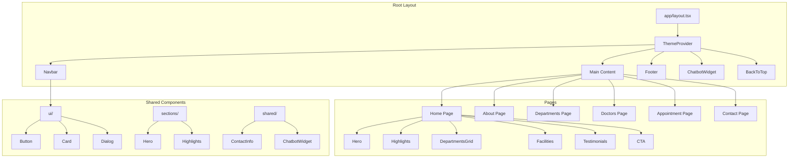

# Prince Hospital Website - Project Plan

## Project Overview
Modern, responsive, ultra-fast hospital website for "Prince Hospital" using Next.js 14 (App Router) with TypeScript and Tailwind CSS.

## Technical Stack
- **Framework**: Next.js 14 (App Router)
- **Language**: TypeScript
- **Styling**: Tailwind CSS
- **UI Components**: shadcn/ui
- **Animations**: Framer Motion (lightweight)
- **Icons**: lucide-react
- **Theme**: next-themes for dark mode
- **Performance**: Optimized for Lighthouse scores

## Project Structure
```
prince-hospital/
├── app/
│   ├── layout.tsx           # Root layout with providers
│   ├── page.tsx            # Home page
│   ├── about/
│   │   └── page.tsx        # About page
│   ├── departments/
│   │   └── page.tsx        # Departments page
│   ├── doctors/
│   │   └── page.tsx        # Doctors page
│   ├── appointment/
│   │   └── page.tsx        # Appointment page
│   └── contact/
│       └── page.tsx        # Contact page
├── components/
│   ├── ui/                 # shadcn/ui components
│   ├── layout/
│   │   ├── Navbar.tsx
│   │   ├── Footer.tsx
│   │   └── ThemeToggle.tsx
│   ├── sections/           # Reusable page sections
│   │   ├── Hero.tsx
│   │   ├── Highlights.tsx
│   │   ├── DepartmentsGrid.tsx
│   │   ├── Facilities.tsx
│   │   ├── Testimonials.tsx
│   │   └── CTA.tsx
│   ├── shared/
│   │   ├── ChatbotWidget.tsx
│   │   ├── BackToTop.tsx
│   │   └── ContactInfo.tsx
│   └── cards/
│       ├── DoctorCard.tsx
│       └── DepartmentCard.tsx
├── lib/
│   ├── utils.ts
│   └── constants.ts
├── public/
│   ├── images/
│   └── logo.svg
└── styles/
    └── globals.css
```

## Pages & Features

### 1. Home Page
- Hero section with headline and CTA buttons
- Quick highlights (700+ beds, advanced diagnostics, 24/7 emergency)
- Department preview grid (6-8 departments)
- Facilities section with icons
- Testimonials carousel (dummy data)
- Final CTA section with phone number

### 2. About Page
- Hospital history and mission
- Vision and values
- Leadership team (placeholder)
- Achievements and certifications

### 3. Departments/Services Page
- Grid of all medical departments
- Filter by specialty
- Detailed service descriptions
- Department-specific contact

### 4. Doctors Page
- Grid of doctor cards with:
  - Photo placeholder
  - Name, specialization
  - Qualifications
  - Experience
  - Availability status

### 5. Appointment Page
- Big CTA button "Start Appointment Booking via Chatbot"
- Instructions for booking
- Contact alternatives
- Opens chatbot modal on click

### 6. Contact Page
- Contact form
- Map placeholder
- All contact details
- Operating hours

## Common Components

### Navbar
- Sticky navigation
- Logo + menu items
- CTA button "Book Appointment"
- Mobile hamburger menu
- Theme toggle

### Footer
- Hospital logo and tagline
- Quick links
- Contact details
- Social media links
- Copyright

### Chatbot Widget
- Floating button (bottom-right)
- Modal with welcome message
- Quick options:
  - Book Appointment
  - Find Doctor
  - Emergency Contact
  - General Inquiry
- Lightweight, minimal UI

### Back to Top Button
- Appears on scroll
- Smooth scroll to top
- Positioned bottom-right (above chatbot)

## Design Specifications

### Color Scheme
- **Primary**: Hospital blue (#2563eb) - Trust, professionalism
- **Secondary**: Teal (#0d9488) - Health, calmness
- **Accent**: Emerald (#10b981) - Growth, vitality
- **Neutral**: Gray scale for text and backgrounds
- **Dark mode**: Tailwind dark: variant

### Typography
- **Headings**: Inter (sans-serif) - Modern, clean
- **Body**: Inter or system font stack
- **Font weights**: Regular 400, Medium 500, Semibold 600, Bold 700

### Spacing & Layout
- Consistent 8px base unit
- Max-width container: 1280px
- Section padding: 4rem on desktop, 2rem on mobile
- Card border radius: rounded-2xl
- Soft shadows: shadow-lg with subtle opacity

### Animations
- Fade-in on scroll (Intersection Observer)
- Smooth hover transitions
- Page transition effects
- Staggered grid animations
- **Performance focus**: Use `motion` with `initial` and `whileInView` only

## Performance Optimization
1. **Image optimization**: Next.js Image component
2. **Font optimization**: Next/font with subset
3. **Code splitting**: Automatic with App Router
4. **Lazy loading**: Components and images
5. **Minimal dependencies**: Only essential packages
6. **Bundle analysis**: Regular checks

## SEO Implementation
- Metadata for each page (title, description, keywords)
- Open Graph tags
- Twitter cards
- JSON-LD structured data for hospital
- Sitemap.xml
- robots.txt

## Development Workflow

### Phase 1: Project Setup
1. Initialize Next.js 14 with TypeScript
2. Install and configure Tailwind CSS
3. Set up shadcn/ui components
4. Install additional dependencies

### Phase 2: Core Components
1. Create layout components (Navbar, Footer)
2. Implement theme provider
3. Create shared components

### Phase 3: Pages Development
1. Home page with all sections
2. About page
3. Departments page
4. Doctors page
5. Appointment page
6. Contact page

### Phase 4: Features & Polish
1. Chatbot widget implementation
2. SEO metadata
3. Back-to-top button
4. Animations and micro-interactions
5. Dark mode refinement

### Phase 5: Testing & Optimization
1. Responsive testing
2. Performance testing (Lighthouse)
3. Cross-browser testing
4. Accessibility audit
5. Final optimizations

## Contact Details (To be included everywhere)
- **Address**: Bajor, Sikar, Rajasthan, India
- **Appointment/Enquiry**: 72300 90108
- **Doctors Queries**: 72300 32018
- **Non-Doctor Queries**: 72300 44108
- **Email**: contact@princehospital.in

## Success Metrics
- Lighthouse Performance score: 95+
- Mobile responsive: Perfect on all devices
- Fast loading: < 2s initial load
- Accessibility: WCAG 2.1 AA compliant
- SEO: Properly indexed pages

## Mermaid Diagram: Component Architecture



## Next Steps
1. Initialize the project with the technical stack
2. Create the folder structure
3. Implement core layout components
4. Build pages sequentially
5. Add features and polish
6. Test and optimize